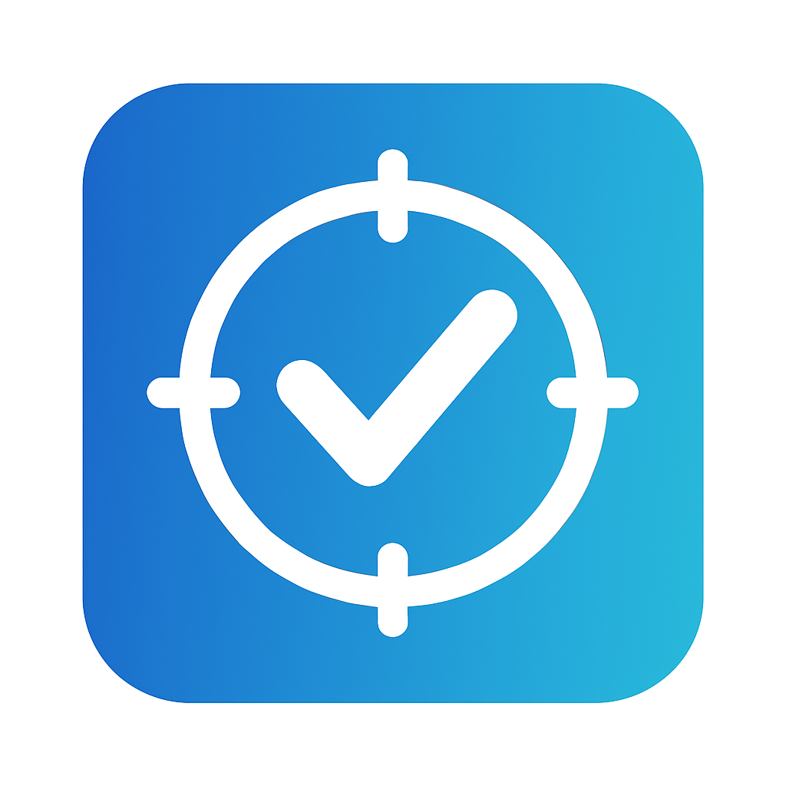
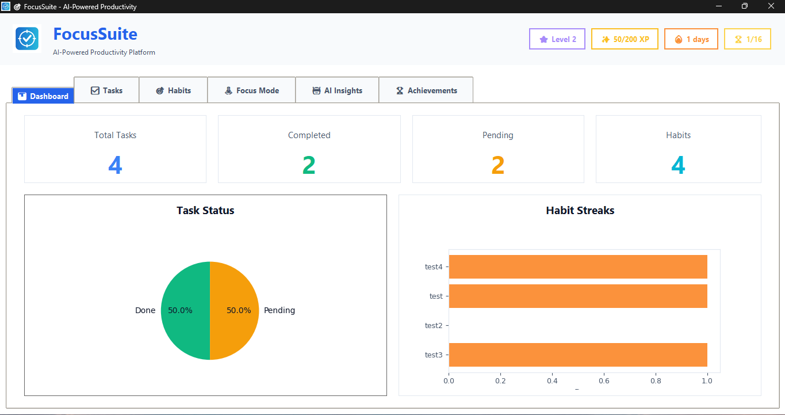
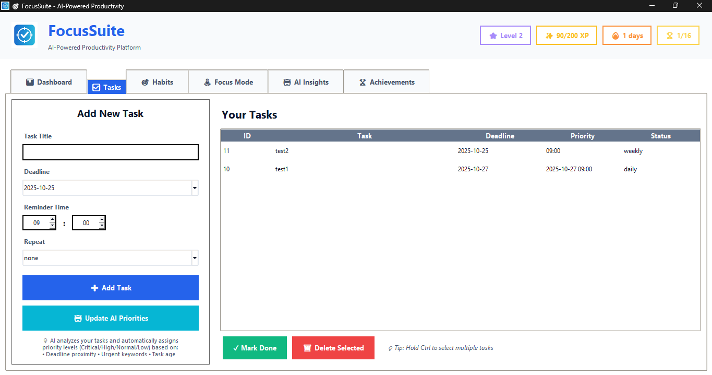
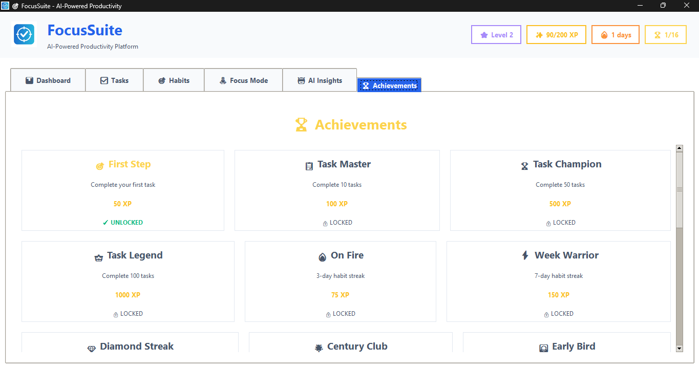
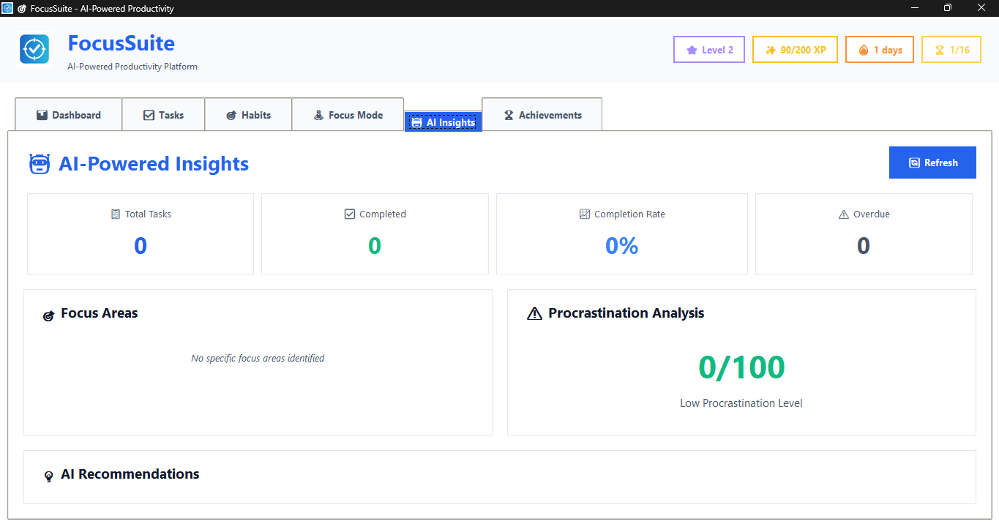

# 🎯 FocusSuite - AI-Powered Productivity App

<div align="center">



**The Ultimate Task & Habit Manager with AI Intelligence and Gamification**

[](https://www.python.org/downloads/)
[](LICENSE)
[]()

</div>

---

## ✨ Overview

FocusSuite is a modern, AI-powered productivity application that combines task management, habit tracking, and gamification to help you achieve your goals. Built with Python and Tkinter, it features a beautiful dark theme UI and intelligent features that adapt to your workflow.

## 🚀 Key Features

### 🤖 AI-Powered Intelligence

- **Smart Task Prioritization**: Machine learning algorithms analyze your tasks and automatically assign priority levels based on:
  - Deadline proximity (40% weight)
  - Keyword urgency analysis (30% weight)
  - Task age and procrastination patterns (20% weight)
  - Task complexity (10% weight)

- **Productivity Insights**: Advanced analytics that track:
  - Completion rates and patterns
  - Procrastination scores
  - Focus areas and common themes
  - Personalized AI recommendations

- **Predictive Analytics**: Estimates task completion time based on historical data and task characteristics

- **Habit Intelligence**: AI-powered coaching with personalized tips and milestone tracking

### 🎮 Gamification System

- **XP & Leveling**: Earn experience points for completing tasks and checking habits
  - Tasks: +50 XP
  - Habits: +25 XP
  - Level up every 100 XP

- **16 Achievements to Unlock**:
  - 🎯 First Step - Complete your first task (50 XP)
  - 🔥 On Fire - 3-day habit streak (75 XP)
  - 💎 Diamond Streak - 30-day habit streak (500 XP)
  - 🏆 Task Champion - Complete 50 tasks (500 XP)
  - 👑 Task Legend - Complete 100 tasks (1000 XP)
  - And 11 more!

- **Streak System**: Track consecutive days of app usage and habit completion

- **Streak Protection**: Earn freeze days to protect your streaks

### 📊 Dashboard & Analytics

- **Visual Analytics**: Beautiful charts showing:
  - Task completion pie charts
  - Habit streak bar graphs
  - Productivity trends

- **Quick Stats Cards**: At-a-glance overview of:
  - Total tasks
  - Completed vs pending
  - Active habits
  - Current streaks

### 🤖 AI Insights Dashboard

- **Stat Cards**: Total tasks, completed, completion rate, overdue
- **Focus Areas**: AI-identified priority areas with bullet points
- **Procrastination Analysis**: Visual score meter (0-100) with color coding
- **Smart Recommendations**: Numbered list of personalized tips
- **Scrollable Content**: All insights easily accessible

### ✅ Advanced Task Management

- **Smart Features**:
  - Deadline tracking with visual indicators
  - Reminder notifications
  - Recurring tasks (daily/weekly)
  - AI-calculated priority levels (Critical/High/Normal/Low)
  - Task status tracking

- **Flexible Input**: Natural language-friendly task creation

### 🎯 Habit Tracking

- **Full CRUD Operations**: Add, Edit, Rename, Reset streaks, Delete habits
- **Streak Tracking**: Monitor consecutive days for each habit
- **Daily Check-ins**: Simple one-click habit completion
- **Management Buttons**: Check Today, Edit Name, Reset Streak, Delete
- **Streak Analytics**: Visualize your consistency with 🔥 emoji
- **XP Rewards**: Earn 25 XP for each habit check

### 🧘 Focus Mode (Pomodoro Timer)

- **Customizable Sessions**:
  - 25-minute work sessions
  - 5-minute short breaks
  - 15-minute long breaks (every 4 sessions)

- **Automatic Tracking**: Focus time automatically recorded and rewarded with XP

- **Session Management**: Start, pause, reset controls

### 🎨 Modern UI/UX

- **Modern Theme**: Professional card-based design
- **Responsive Layout**: Adapts to different window sizes
- **Color-coded Elements**: Visual indicators for priorities and status
- **Compact Forms**: Optimized spacing for better visibility
- **Achievement Grid**: 3-column layout with icons and badges
- **Gamification Header**: Level, XP, streak, and achievements always visible

## 📸 Screenshots

### Dashboard

*Overview with stats, charts, and AI insights*

### Tasks with AI Prioritization

*Smart task management with AI-calculated priorities*

### Achievements

*Unlock badges and earn XP*

### AI Insights

*Personalized productivity recommendations*

## 🛠️ Installation

### Prerequisites

- Python 3.8 or higher
- pip (Python package manager)

### Step 1: Clone the Repository

```bash
git clone https://github.com/xioterepart/FocusSuite.git
cd FocusSuite
```

### Step 2: Install Dependencies

```bash
pip install -r requirements.txt
```

**Note**: If you encounter NumPy compatibility issues, the requirements.txt already includes `numpy<2.0.0` to ensure compatibility with matplotlib 3.7.1.

### Step 3: Run the Application

```bash
python main.py
# or on Windows:
py main.py
```

**First Launch**: The app will create `focussuite.db` and `gamification.json` automatically.

## 📦 Project Structure

```
FocusSuite/
│
├── main.py                 # Application entry point
├── gui.py                  # Main GUI with all tabs
├── database.py             # SQLite database operations
├── ai_engine.py            # AI-powered features
├── gamification.py         # XP, levels, achievements
├── theme.py                # Modern UI theme system
├── focus_mode.py           # Pomodoro timer
├── notifications.py        # Reminder system
│
├── assets/                 # Icons and images
│   ├── icon.png
│   └── app.ico
│
├── requirements.txt        # Python dependencies
├── README.md               # This file
├── focussuite.db           # SQLite database (auto-created)
└── gamification.json       # Gamification state (auto-created)
```

### 🧠 AI Features Explained

### Smart Task Prioritization Algorithm

The AI engine uses a multi-factor scoring system:

```python
Priority Score = (Deadline Factor × 0.4) + 
                 (Keyword Urgency × 0.3) + 
                 (Task Age × 0.2) + 
                 (Complexity × 0.1)
```

**Deadline Factor**: Exponentially increases as deadline approaches
- Overdue: 40 points
- Due today: 35 points
- Due tomorrow: 30 points
- Due within 3 days: 25 points

**Keyword Urgency**: NLP-based analysis of task titles
- Detects urgent keywords: "urgent", "asap", "critical", "important", "meeting", "deadline"
- Each keyword adds weighted points

**Task Age**: Procrastination penalty
- Older tasks get higher priority
- Encourages tackling long-pending items

### Productivity Pattern Analysis

The AI Insights Dashboard shows:
- **Completion Rate**: Overall task success percentage
- **Procrastination Score**: 0-100 scale with color coding (Green: Low, Orange: Moderate, Red: High)
- **Focus Areas**: Common themes in your tasks
- **Smart Recommendations**: Personalized productivity tips based on your patterns

## 🎮 Gamification Mechanics

### XP System

- **Level Formula**: `XP needed for level N = N × 100`
- **Level 1 → 2**: 100 XP
- **Level 2 → 3**: 200 XP
- **Level 10 → 11**: 1000 XP

### Achievement Categories

1. **Task Milestones**: 1, 10, 50, 100 tasks completed
2. **Habit Streaks**: 3, 7, 30, 100 days
3. **Special**: Early bird, night owl, speed demon, perfect day
4. **Focus**: Focus master (2 hours in focus mode)

## 🔔 Notifications

Background reminder system checks every 30 seconds for:
- Tasks with reminder times
- Upcoming deadlines
- Habit check-in reminders

## 💾 Data Storage

- **Tasks & Habits**: SQLite database (`focussuite.db`)
- **Gamification Data**: JSON file (`gamification.json`)
- **Automatic Backups**: Database persists between sessions

## 🎨 Customization

### Modify Theme Colors

Edit `theme.py`:

```python
class ModernTheme:
    PRIMARY = "#6366f1"  # Change primary color
    SECONDARY = "#ec4899"  # Change secondary color
    # ... more colors
```

### Adjust Pomodoro Times

Edit `focus_mode.py`:

```python
self.work_duration = 25 * 60  # Work session (minutes)
self.break_duration = 5 * 60  # Short break
self.long_break_duration = 15 * 60  # Long break
```

### Add Custom Achievements

Edit `gamification.py`:

```python
ACHIEVEMENTS = {
    'your_achievement': {
        'name': '🎯 Your Achievement',
        'desc': 'Description here',
        'xp': 100
    },
    # ... more achievements
}
```

## 🐛 Troubleshooting

### NumPy Compatibility Error

If you see `AttributeError: _ARRAY_API not found` or NumPy version conflicts:

```bash
# Uninstall incompatible NumPy
py -m pip uninstall numpy -y

# Reinstall with correct version
py -m pip install -r requirements.txt
```

The requirements.txt includes `numpy<2.0.0` to ensure compatibility.

### App Won't Start

```bash
# Ensure all dependencies are installed
py -m pip install -r requirements.txt

# Check Python version (3.8+ required)
py --version

# Run from project directory
cd c:/Users/hp/OneDrive/Documents/FocusSuite
py main.py
```

### Database Issues

If you encounter database errors:
- Delete `focussuite.db` to reset (⚠️ loses all data)
- Delete `gamification.json` to reset XP/achievements

### Notifications Not Working

- Check Windows notification settings
- Ensure plyer is installed: `py -m pip install plyer`

## 🚀 Recent Updates

- ✅ Full habit management (Edit, Rename, Reset, Delete)
- ✅ Modern AI Insights dashboard with stat cards
- ✅ Improved achievements layout with filtering
- ✅ Compact task form for better visibility
- ✅ Multi-select tasks for batch operations
- ✅ Gamification stats in header

## 🔮 Future Enhancements

- [ ] Cloud sync across devices
- [ ] Mobile app
- [ ] Team collaboration features
- [ ] Calendar integration
- [ ] Export to PDF/CSV
- [ ] Advanced AI: Task time prediction
- [ ] Custom themes

## 🤝 Contributing

Contributions are welcome! Please feel free to submit a Pull Request.

1. Fork the repository
2. Create your feature branch (`git checkout -b feature/AmazingFeature`)
3. Commit your changes (`git commit -m 'Add some AmazingFeature'`)
4. Push to the branch (`git push origin feature/AmazingFeature`)
5. Open a Pull Request

## 📝 License

This project is licensed under the MIT License - see the [LICENSE](LICENSE) file for details.

## 👨‍💻 Author

Created with by Lina El Boudadi

## 🙏 Acknowledgments

- Inspired by productivity apps like Todoist, Habitica, and Forest
- AI algorithms inspired by modern ML practices
- UI design inspired by modern web applications

## 📧 Contact

For questions or feedback:
- Email: elboudadilina2@example.com
- GitHub: [@xioterepart](https://github.com/xioterepart)
- LinkedIn: [@Lina ElBoudadi](https://www.linkedin.com/in/lina-elboudadi-286198264/)

---

<div align="center">

**Made with Focus and Passion**

Star ⭐ this repository if you find it helpful!

</div>